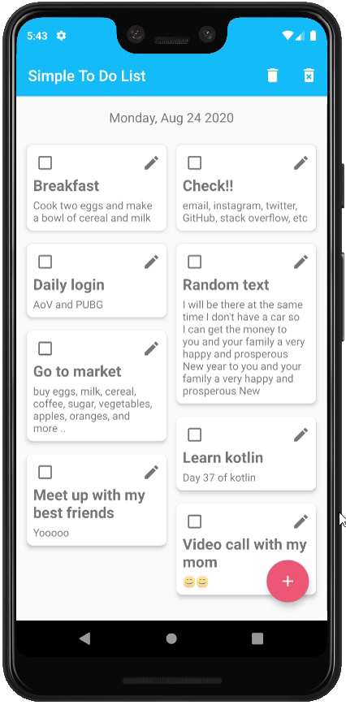

## Demo


## Resources
- ViewModel
  https://developer.android.com/topic/libraries/architecture/viewmodel
- LiveData
  https://developer.android.com/topic/libraries/architecture/livedata
- Data Binding
  https://developer.android.com/topic/libraries/data-binding
- Navigation Component
  https://developer.android.com/guide/navigation
- Kotlin Coroutines
  https://developer.android.com/topic/libraries/architecture/coroutines
- RecyclerView Animators
  https://github.com/wasabeef/recyclerview-animators
  

### License
```
   Copyright (C) 2020 Agus Tiyansyah Syam
   Licensed under the Apache License, Version 2.0 (the "License");
   you may not use this file except in compliance with the License.
   You may obtain a copy of the License at

       http://www.apache.org/licenses/LICENSE-2.0

   Unless required by applicable law or agreed to in writing, software
   distributed under the License is distributed on an "AS IS" BASIS,
   WITHOUT WARRANTIES OR CONDITIONS OF ANY KIND, either express or implied.
   See the License for the specific language governing permissions and
   limitations under the License.
```
